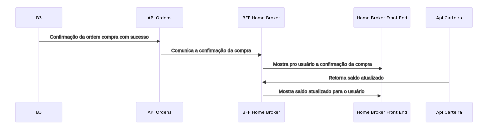

### 1 
  - Médio, sem a api de saldo não conseguiremos validar as informações que serão enviadas para a api da carteira, mas conseguimo seguir com o desenvolvimento enquando a equipe cria essa api de saldo
  - Alto, a contratação de mão de obra pode ser dificil dependando da tecnologia utilizada, oque pode afetar a data de entrega do projeto
  - Baixo, o estudo da API da B3 é algo que ja era esperado e podemos fazer isso enquando desenvolvemos

### 2

### 3
 - Risco 2
    - **O que ?** Contratação de novos desenvolvedores para ajudar no desenvolvimento da aplicação
    - **Quem ?** Arquiteto de soluções o time de RH
    - **Onde ?** Empresa que está desenvolvendo a aplicação
    - **Quando ?** No pŕoximo mês 
    - **Como ?** O time de RH ir procurar pessoas com os conhecimentos necessários para fazer parte do time e fazer o recrutamento
    - **Quanto ?** Temos um custo de R$5000 para investir na procura dos desenvolvedores e na divulgação das vagas
    - **Por quê ?** Por conta da quantidade de entregar que precisamos fazer, é necessário a contratação de mais mão de obra para conseguir entregar a aplicação no prazo

### 4

